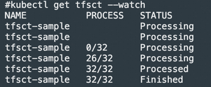

中文 | [English](./README_en.md)

# 概览
此repo用于[3FS](https://github.com/deepseek-ai/3FS)自动化部署，基于operator-sdk开发，具体包含下面功能：

+ 3FS组件一键拉起，包括clickhouse/monitor/fdb/meta/mgmtd/storage组件，支持连接云上clickhouse数据库
+ fuse sidecar动态注入业务pod
+ fdb/mgmtd/meta组件故障自动替换
+ 3FS存储节点替换

# 快速使用

支持物理机/阿里云ECS/阿里云ACK环境

## 前置操作
步骤0：Kubernetes环境构建

至少两节点，每节点包含支持RDMA的网卡和裸盘

步骤1：前置检查(检查分区/是否存在文件系统)，该检查防止用户数据丢失：[pre_check.sh](./scripts/pre_check.sh)

步骤2：在storage server节点上，格式化硬盘并挂载文件系统（包括后续需要替换或扩容的新节点上），根据每个存储节点硬盘数量和类型修改该执行脚本，注意替换对应的硬盘数据和硬盘类型。
```shell
# 创建硬盘挂载目录
mkdir -p /storage/data{0..11}

# 格盘+挂载
for i in {0..11};do mkfs.xfs -L data${i} /dev/nvme${i}n1;mount -o noatime,nodiratime -L data${i} /storage/data${i};done

# 创建3fs目录
mkdir -p /storage/data{0..11}/3fs

# 注意每次删除集群重新部署需要把/storage/data{0..11}/3fs/*目录清空（同理加入新节点，替换的新节点也要清空该目录）
rm -rf /storage/data{0..11}/3fs/*
```

步骤3：在fdb节点上，若需要挂一块独立盘，挂载到/opt/3fs/fdb路径；注意：各副本元数据和数据的比例大概为4.8GiB : 1TiB，因为用户需要根据集群存储空间，设置合理的fdb空间，同时做一些空间预留。从最佳实践的角度，3节点2副本的meta部署下，建议给1PiB的存储空间留出每个节点3.2TiB或者以上的fdb空间

```shell
mkfs.xfs /dev/nvme0n1
mkdir -p /opt/3fs/fdb
# 注意每次删除集群重新部署需要把/opt/3fs/fdb/*目录清空
mount /dev/nvme0n1 /opt/3fs/fdb
```

如果使用一块1T的硬盘作为fdb的本地存储，则需要的FDB节点配置如下：

| 副本数/个 | 3FS数据容量/TiB | FDB节点数/个 |
| :---: |:-----------:| :---: |
| 2 |    0-270    | 3 |
| 2 |   271-360   | 4 |
| 2 |   361-450   | 5 |
| 2 |   451-540   | 6 |
| |             | |
| 3 |    0-300    | 5 |
| 3 |   301-360   | 6 |
| 3 |   361-420   | 7 |
| 3 |   421-480   | 8 |


步骤4：修改/etc/hosts文件，添加hostname对应的ip信息；

```plain
# 修改/etc/hosts文件，添加上hostname对应ip，如
172.25.184.234 iZ2ze69ftal0df4ra7jqgeZ
```

步骤5：若使用阿里云ECS或ACK环境，需要确保storage节点使能ERDMA，且在所有节点执行以下命令，设置RDMA建链方式为兼容模式

```shell
sudo sh -c "echo 'options erdma compat_mode=Y' >> /etc/modprobe.d/erdma.conf"
sudo rmmod erdma
sudo modprobe erdma compat_mode=Y
```

## operator部署
基于helm工具部署: [three-fs-control-plane-1.0.0.tgz](./deploy/three-fs-control-plane-1.0.0.tgz)

对于不同部署环境，修改value.yaml中字段或helm install时传入参数
- 物理机/ECS的K8s环境
  - useHostNetwork: true
- ACK环境：
  - useHostNetwork: false

```shell
# 部署operator
helm install three-fs-control-plane ./three-fs-control-plane-1.0.0.tgz

# 删除operator
helm uninstall three-fs-control-plane  
```


## 初始化集群
+ 通过node label标签指定fdb/storage部署的节点池

```shell
# 在部署fdb组件的节点上打标
threefs.aliyun.com/fdb-node=true

# 在部署storage组件的节点上打标（在创建cluster集群前打标的node将全部作为存储节点，在cluster创建成功后打标的node作为备用存储节点，用于节点替换）
threefs.aliyun.com/storage-node=true
```

+ CRD含义请参考文档: [threefscluster.yaml](./docs/examples/threefscluster.yaml)

```shell
# 创建集群
kubectl apply -f ./docs/examples/threefscluster.yaml

# 删除集群
kubectl delete -f ./docs/examples/threefscluster.yaml

# 查看crd详细状态
kubectl get tfsc tfsc-sample -o yaml
```

- 下图为3个fdb节点，4个storage节点，meta/mgmtd均为2副本，使用本地clickhouse环境，部署pod示意图


## 集群健康状态查询
查询当前集群状态， 包含meta/mgmtd/storage/fdb等节点信息：

```plain
kubectl get tfsc tfsc-sample -o yaml
```

当前集群meta/mgmtd/storage组件健康状态：


fdb集群健康状态


非健康target状态：unhelthyTargetStatus中记录了节点维度的非健康target列表


## **fuse client创建**
部署集群后，请确保CRD状态为ready并且status详情中没有非健康target，再创建client

client pod demo：[client pod](docs/examples/pod.yaml)

+ 在创建的pod资源中，指定下述label，webhook会自动注入fuse sidecar
    - 文件挂载路径/data
    - threefscluster CRD的name/namepsace 
    - threefs.aliyun.com/sidecar: "threefs" 为pod selector
    - shm-size为fuse容器和业务容器共享的/dev/shm大小

```plain
threefs.aliyun.com/sidecar: "threefs"
threefs.aliyun.com/mountpath: "data"
threefs.aliyun.com/threefscluster: "tfsc-sample"
threefs.aliyun.com/threefscluster-ns: "default"
threefs.aliyun.com/shm-size: "10Gi"
```


# 存储节点替换
使用ThreeFsChainTable CRD进行节点替换，在CRD中oldNode/newNode字段指定节点信息，该操作会在新节点上拉起storage组件，并替换老节点上的target接入chain中

替换的新节点务必提前加入到备用节点池中（可从ThreeFsCluster CRD的status nodeinfo字段中查看备用节点是否加入），并格式化磁盘，同时要清空/storage/data{xx}/3fs/*目录


存储节点替换demo：[节点替换](docs/examples/threefschaintable-replace.yaml)

```shell
kubectl apply -f docs/examples/threefschaintable-replace.yaml 
```
- 创建成功后，可查看替换状态和进度



# 集群删除&operator卸载
```shell
# 删除集群
kubectl delete -f ./docs/examples/threefscluster.yaml

# 各节点上清除pod挂载数据
rm -rf /opt/3fs/*

# 各存储节点清除3fs数据
rm -rf /storage/data{0..11}/3fs/*

# 卸载operator+删除webhook configuration
helm uninstall three-fs-control-plane
kubectl delete validatingWebhookConfiguration threefs-validation-webhook && kubectl delete mutatingWebhookConfiguration threefs-mutating-webhook
```

# 构建
- 构建operator base image（3fs cluster/chaintable operator的base image）
```shell
docker build --no-cache -f ./docker/threefs/Dockerfile.base -t {your_harbor}/3fs-operator-base:v1 .
```
- 构建3fs cluster operator
```shell
docker build --no-cache -f ./docker/threefs/Dockerfile -t {your_harbor}/3fs-cluster-operator:v1 .
```
- 构建3fs chaintable operator
```shell
docker build --no-cache -f ./docker/threefs/Dockerfile.chaintable -t {your_harbor}/3fs-chaintable-operator:v1 .
```

- 构建genera key镜像
```shell
docker build -f ./docker/generate-keys/Dockerfile.base -t {your_harbor}/generate-keys:base .
docker build -f ./docker/generate-keys/Dockerfile -t {your_harbor}/generate-keys:0725 .
```


