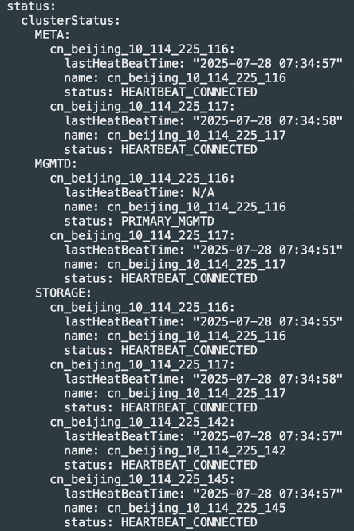
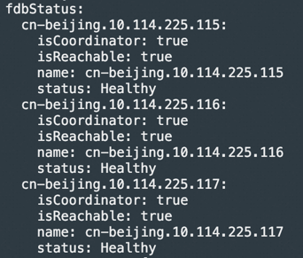
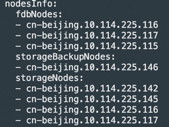

[中文](./README.md) | English

# Overview
This repository is used for the automated deployment of [3FS](https://github.com/deepseek-ai/3FS), developed based on the operator-sdk. It includes the following functionalities:

+ One-click startup of 3FS components, including clickhouse/monitor/fdb/meta/mgmtd/storage components, with support for connecting to a cloud-based clickhouse database.
+ Dynamic injection of fuse sidecar into business pods.
+ Automatic replacement of faulty fdb/mgmtd/meta components.
+ Replacement of 3FS storage nodes.

# Quick Start

Supports physical machines/Aliyun ECS/Aliyun ACK environments.

## Prerequisites
Step 0: Build the Kubernetes environment

At least two nodes, each equipped with an RDMA-supported NIC and raw disks.

Step 1: Pre-check (check partitions/existence of file systems) to prevent user data loss: [pre_check.sh](./scripts/pre_check.sh)

Step 2: On the storage server nodes, format the hard drives and mount the file systems (including new nodes that will be added or expanded later). Modify the execution script according to the number and type of hard drives on each storage node, ensuring to replace the corresponding hard drive data and types.
```shell
# Create hard drive mount directories
mkdir -p /storage/data{0..11}

# Format and mount
for i in {0..11}; do mkfs.xfs -L data${i} /dev/nvme${i}n1; mount -o noatime,nodiratime -L data${i} /storage/data${i}; done

# Create 3fs directories
mkdir -p /storage/data{0..11}/3fs

# Note: Every time you delete the cluster and redeploy, you need to clear the /storage/data{0..11}/3fs/* directories (similarly, for newly added or replaced nodes, these directories should also be cleared)
rm -rf /storage/data{0..11}/3fs/*
```

Step 3: On the fdb nodes, if you need to mount a separate disk, mount it to the /opt/3fs/fdb path. Note: The ratio of metadata to data for each replica is approximately 4.8GiB : 1TiB. Therefore, users need to set a reasonable fdb space based on the cluster's storage capacity while reserving some space. As a best practice, under a 3-node, 2-replica meta deployment, it is recommended to allocate at least 3.2TiB or more of fdb space per node for 1PiB of storage space.

```shell
mkfs.xfs /dev/nvme0n1
mkdir -p /opt/3fs/fdb
# Note: Every time you delete the cluster and redeploy, you need to clear the /opt/3fs/fdb/* directories
mount /dev/nvme0n1 /opt/3fs/fdb
```

If using a 1TB hard drive as local storage for fdb, the required FDB node configuration is as follows:

| Replicas | 3FS Data Capacity/TiB | FDB Nodes |
| :---: |:-----------:| :---: |
| 2 |    0-270    | 3 |
| 2 |   271-360   | 4 |
| 2 |   361-450   | 5 |
| 2 |   451-540   | 6 |
| |             | |
| 3 |    0-300    | 5 |
| 3 |   301-360   | 6 |
| 3 |   361-420   | 7 |
| 3 |   421-480   | 8 |


Step 4: Modify the /etc/hosts file, adding the IP information corresponding to the hostname;

```plain
# Modify the /etc/hosts file, add the IP corresponding to the hostname, such as:
172.25.184.234 iZ2ze69ftal0df4ra7jqgeZ
```

Step 5: If using Alibaba Cloud ECS or ACK environments, ensure that ERDMA is enabled on the storage nodes, and execute the following commands on all nodes to set the RDMA connection mode to compatibility mode.

```shell
sudo sh -c "echo 'options erdma compat_mode=Y' >> /etc/modprobe.d/erdma.conf"
sudo rmmod erdma
sudo modprobe erdma compat_mode=Y
```

## Operator Deployment
Deploy using the helm tool: [three-fs-control-plane-1.0.0.tgz](./deploy/three-fs-control-plane-1.0.0.tgz)

For different deployment environments, modify the fields in value.yaml or pass parameters during helm install.
- Physical machine/ECS Kubernetes environment:
  - useHostNetwork: true
- ACK environment:
  - useHostNetwork: false

```shell
# Deploy operator
helm install three-fs-control-plane ./three-fs-control-plane-1.0.0.tgz

# Uninstall operator
helm uninstall three-fs-control-plane  
```


## Initialize Cluster
+ Use node labels to specify the node pool for fdb/storage deployment

```shell
# Label the nodes where the fdb component will be deployed
threefs.aliyun.com/fdb-node=true

# Label the nodes where the storage component will be deployed (nodes labeled before creating the cluster will all be used as storage nodes, and nodes labeled after the cluster is created will be used as standby storage nodes for node replacement)
threefs.aliyun.com/storage-node=true
```

+ Refer to the documentation for the meaning of CRD: [threefscluster.yaml](./docs/examples/threefscluster.yaml)

```shell
# Create cluster
kubectl apply -f ./docs/examples/threefscluster.yaml

# Delete cluster
kubectl delete -f ./docs/examples/threefscluster.yaml

# View detailed status of crd
kubectl get tfsc tfsc-sample -o yaml
```

- The diagram below shows 3 fdb nodes, 4 storage nodes, meta/mgmtd both with 2 replicas, using a local clickhouse environment, and a schematic of the deployed pods.
  

## Cluster Health Status Query
Query the current cluster status, including information about meta/mgmtd/storage/fdb nodes:

```plain
kubectl get tfsc tfsc-sample -o yaml
```

Current health status of meta/mgmtd/storage components in the cluster:



Health status of the fdb cluster



Unhealthy target status: unhelthyTargetStatus records the list of unhealthy targets at the node level


## **Fuse Client Creation**
After deploying the cluster, ensure that the CRD status is ready and there are no unhealthy targets in the status details before creating the client.

Client pod demo: [client pod](docs/examples/pod.yaml)

+ In the created pod resource, specify the following labels, and the webhook will automatically inject the fuse sidecar.
  - File mount path /data
  - Name/namespace of the threefscluster CRD
  - threefs.aliyun.com/sidecar: "threefs" as the pod selector
  - shm-size as the size of the shared /dev/shm between the fuse container and the business container

```plain
threefs.aliyun.com/sidecar: "threefs"
threefs.aliyun.com/mountpath: "data"
threefs.aliyun.com/threefscluster: "tfsc-sample"
threefs.aliyun.com/threefscluster-ns: "default"
threefs.aliyun.com/shm-size: "10Gi"
```


# Storage Node Replacement
Use the ThreeFsChainTable CRD for node replacement, specifying the node information in the oldNode/newNode fields in the CRD. This operation will start the storage component on the new node and replace the target on the old node in the chain.

The new node must be pre-added to the standby node pool (can be checked from the status nodeinfo field of the ThreeFsCluster CRD), and the disks must be formatted, while clearing the /storage/data{xx}/3fs/* directories.



Storage node replacement demo: [Node Replacement](docs/examples/threefschaintable-replace.yaml)

```shell
kubectl apply -f docs/examples/threefschaintable-replace.yaml 
```
- After successful creation, you can view the replacement status and progress


# Cluster Deletion & Operator Uninstallation
```shell
# Delete cluster
kubectl delete -f ./docs/examples/threefscluster.yaml

# Clear pod mount data on each node
rm -rf /opt/3fs/*

# Clear 3fs data on each storage node
rm -rf /storage/data{0..11}/3fs/*

# Uninstall operator + delete webhook configuration
helm uninstall three-fs-control-plane
kubectl delete validatingWebhookConfiguration threefs-validation-webhook && kubectl delete mutatingWebhookConfiguration threefs-mutating-webhook
```

# Build
- Build operator base image (base image for 3fs cluster/chaintable operator)
```shell
docker build --no-cache -f ./docker/threefs/Dockerfile.base -t {your_harbor}/3fs-operator-base:v1 .
```
- Build 3fs cluster operator
```shell
docker build --no-cache -f ./docker/threefs/Dockerfile -t {your_harbor}/3fs-cluster-operator:v1 .
```
- Build 3fs chaintable operator
```shell
docker build --no-cache -f ./docker/threefs/Dockerfile.chaintable -t {your_harbor}/3fs-chaintable-operator:v1 .
```

- Build generate keys image
```shell
docker build -f ./docker/generate-keys/Dockerfile.base -t {your_harbor}/generate-keys:base .
docker build -f ./docker/generate-keys/Dockerfile -t {your_harbor}/generate-keys:0725 .
```