# mini 3fs ecs单机部署流程
为了便于快速体验3fs，我们基于开源项目[m3fs](https://github.com/open3fs/m3fs)进行了轻量级定制，提供了一套无需Kubernetes，仅依赖docker的单机版3fs一键部署方案。对mfs的轻量级定制主要包括以下几点改动：
1. 内置镜像支持
    所有组件所需的镜像（包括支持单副本部署的定制化storage镜像）均已上传至阿里云镜像仓库，并将仓库链接内置在一键启动脚本中，用户无需手动构建或拉取任何镜像；
2. 灵活的存储挂载
    提供独立的挂载命令，可在存储服务启动后，将存储路径挂载到任意指定的本地目录，支持在同一节点上挂载多个目录；
3. 自动化日志管理
    启动时自动创建各组件的日志目录，清理时自动删除，无需用户手动维护；
4. 极简配置
    仅需在配置文件中指定数据存储路径和fdb持久化路径，即可完成单机版3fs的快速启动。


## ECS环境准备
购买ecs gpu实例，如ecs.gn8is.2xlarge (L20 单卡) + ESSD云盘PL0 2048GiB (10000 IOPS)。

### 1、安装docker
```shell
sudo dnf config-manager --add-repo=http://mirrors.cloud.aliyuncs.com/docker-ce/linux/centos/docker-ce.repo
sudo sed -i 's/mirrors.aliyun.com/mirrors.cloud.aliyuncs.com/g' /etc/yum.repos.d/*
sudo sed -i 's/mirrors.openanolis.cn/mirrors.cloud.aliyuncs.com/g' /etc/yum.repos.d/*
sudo dnf install -y --repo alinux3-plus dnf-plugin-releasever-adapter
sudo dnf install -y --setopt=sslverify=false docker-ce
sudo systemctl start docker
sudo systemctl enable docker
sudo dnf install -y anolis-epao-release
sudo dnf install -y nvidia-container-toolkit
sudo systemctl restart docker
```

### 2、[启用erdma](https://help.aliyun.com/zh/ecs/user-guide/on-the-gpu-instance-configuration-erdma?spm=a2c4g.11186623.help-menu-25365.d_0_5_3_0_1_1.79f61f4cpE8crN&scm=20140722.H_2248432._.OR_help-T_cn~zh-V_1)

## 单机版3fs部署
### 1、驱动配置
```shell
# 配置eRDMA驱动兼容模式
sh -c "echo 'options erdma compat_mode=Y' >> /etc/modprobe.d/erdma.conf"

# 重新加载eRDMA驱动
rmmod erdma
modprobe erdma compat_mode=Y
```

### 2、存储路径准备
数据存储路径和fdb持久化路径都可以使用独立挂载的盘，也可以在已有的文件系统上创建目录。

方案一：使用独立挂载的盘
```shell
# 格式化存储设备
mkfs.xfs /dev/nvme0n1
mkfs.xfs /dev/nvme1n1
mkfs.xfs /dev/nvme2n1
mkfs.xfs /dev/nvme3n1
mkfs.xfs /dev/nvme4n1

# 挂载设备
mkdir -p /storage/data0 /storage/data1 /storage/data2 /storage/data3 /opt/3fs/fdb
mount /dev/nvme0n1 /storage/data0
mount /dev/nvme1n1 /storage/data1
mount /dev/nvme2n1 /storage/data2
mount /dev/nvme3n1 /storage/data3
mount /dev/nvme4n1 /opt/3fs/fdb
```

方案二：使用现有的文件系统
```shell
mkdir -p /storage/data0 /storage/data1 /storage/data2 /storage/data3 /opt/3fs/fdb
```

### 3、配置文件准备
将上一步准备的存储路径和fdb路径写入standalone.yaml文件
```yaml
storagePaths:
  - "/storage/data0"
  - "/storage/data1"
  - "/storage/data2"
  - "/storage/data3"
fdbRootPath: "/opt/3fs/fdb"
```

接着执行`hostname -i`确认主机ip，如果结果如下，第一个ip是ipv4格式，则继续步骤4

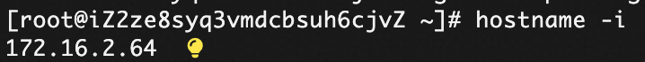

而如果结果如下，第一个ip是ipv6格式，则修改`/etc/hosts`文件，将主机名绑定到ipv4，再继续步骤4
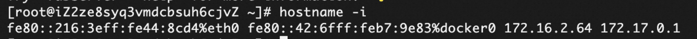
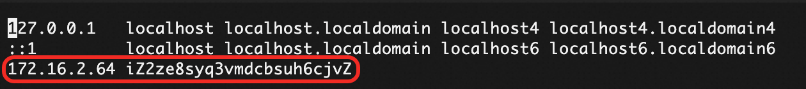


### 4、软件包获取
首选确保已安装[GIT LFS](https://git-lfs.com)
```shell
sudo dnf install git-lfs
git lfs install
```

然后克隆仓库并获取二进制文件
```shell
# 克隆仓库（会自动下载LFS文件）
git clone https://github.com/aliyun/kvc-3fs-operator.git

# 验证m3fs文件是否存在
ls -l tools/m3fs

# 将m3fs文件拷贝至工作目录
cp tools/m3fs path/to/your/working/directory
```

### 5、启动存储集群
```shell
# 启动单机版存储集群
m3fs cluster create-standalone -c standalone.yaml
```

预期结果
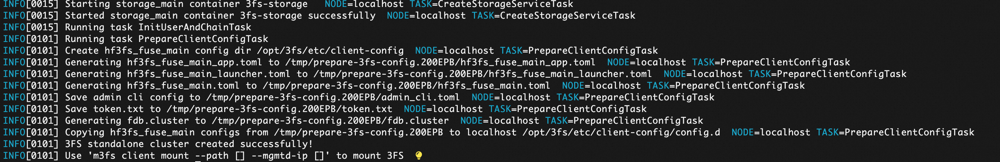

Note：如果遇到
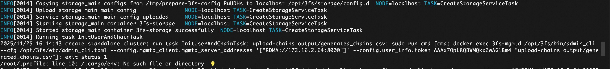

可能需要升级erdma版本

### 6、客户端挂载
```shell
# 挂载存储到本地目录，-p参数指定要挂载的路径，-m参数指定存储节点的IP
m3fs client mount -p /mnt/3fs -m <storage-node-ip>
```
Note：可同时在多个客户端节点执行挂载，每个节点支持挂载多个路径

预期结果
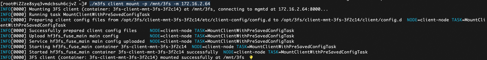
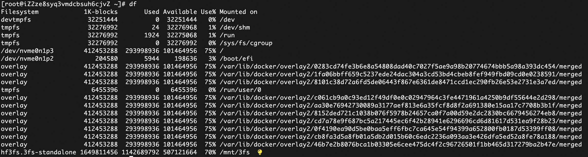

Note：宿主机可以使用fio测试3fs是否能正常写入读出
```shell
fio -numjobs=32 -fallocate=none -iodepth=32 -ioengine=libaio -direct=1 -rw=read -bs=4M --group_reporting -size=100M -time_based -runtime=10 -name=test -directory=/mnt/3fs
```

### 7、系统维护
卸载客户端
```shell
m3fs client umount -p /mnt/3fs
```

销毁存储集群
```shell
m3fs cluster destroy-standalone -c standalone.yaml
```

## vllm hf3fs benchmark测试
PL2(10w iops, 750MB/s)

### 1、vllm容器拉起
```shell
docker run --name test_vllm -it --privileged --shm-size=64g --ulimit memlock=-1  --net=host  --gpus all -v /mnt:/mnt -v /dev/shm:/dev/shm -it --entrypoint /bin/sh mirrors-ssl.aliyuncs.com/vllm/vllm-openai:v0.9.2  -c "while true; do sleep 1000; done"
```

### 2、依赖安装
```shell
export PIP_INDEX_URL=http://mirrors.cloud.aliyuncs.com/pypi/simple/
export PIP_TRUSTED_HOST=mirrors.cloud.aliyuncs.com

# 安装vllm
cd ..
pip uninstall -y vllm
rm -rf vllm
git clone http://gitlab.alibaba-inc.com/wuchenxin.wcx/vllm.git -b feature/support_hf3fs_connector_v0.11.1
cd vllm 
pip install -e .

apt update && apt install -y                            \
  libaio-dev                                            \
  libboost-all-dev                                      \
  libdouble-conversion-dev                              \
  libdwarf-dev                                          \
  libgflags-dev                                         \
  libgmock-dev                                          \
  libgoogle-glog-dev                                    \
  libgoogle-perftools-dev                               \
  libgtest-dev                                          \
  liblz4-dev                                            \
  liblzma-dev                                           \
  libssl-dev                                            \
  libunwind-dev                                         \
  libuv1-dev                \
  zip

# 安装hf3fs_py_usrbio
wget https://zhikuan-wulanchabu.oss-cn-wulanchabu.aliyuncs.com/sglang/dist/hf3fs_py_usrbio-1.2.9%2B394583d-cp312-cp312-linux_x86_64.whl
pip install hf3fs_py_usrbio-1.2.9+394583d-cp312-cp312-linux_x86_64.whl 
export LD_LIBRARY_PATH=$LD_LIBRARY_PATH:/usr/local/lib/python3.12/dist-packages
```

### 3、测试
vllm
```shell
vllm serve /mnt/models/Qwen/Qwen3-14B/     --enforce-eager     --gpu-memory-utilization 0.8     --enable-chunked-prefill     --tensor-parallel-size 1     --block-size 64     --port 30000
```

```shell
nohup vllm bench serve \
  --backend vllm \
  --model /mnt/models/Qwen/Qwen3-14B/ \
  --dataset-name prefix_repetition \
  --num-prompts 100 \
  --prefix-repetition-prefix-len 21000 \
  --prefix-repetition-suffix-len 128 \
  --prefix-repetition-num-prefixes 100 \
  --prefix-repetition-output-len 64 \
  --port 30000 \
  --max-concurrency 10 > long-cold-start.out &
```

```shell
============ Serving Benchmark Result ============
Successful requests:                     100       
Failed requests:                         0         
Maximum request concurrency:             10        
Benchmark duration (s):                  866.94    
Total input tokens:                      2112800   
Total generated tokens:                  6400      
Request throughput (req/s):              0.12      
Output token throughput (tok/s):         7.38      
Peak output token throughput (tok/s):    40.00     
Peak concurrent requests:                11.00     
Total Token throughput (tok/s):          2444.46   
---------------Time to First Token----------------
Mean TTFT (ms):                          73435.49  
Median TTFT (ms):                        77290.51  
P99 TTFT (ms):                           77327.35  
-----Time per Output Token (excl. 1st token)------
Mean TPOT (ms):                          158.89    
Median TPOT (ms):                        159.96    
P99 TPOT (ms):                           160.29    
---------------Inter-token Latency----------------
Mean ITL (ms):                           158.89    
Median ITL (ms):                         51.65     
P99 ITL (ms):                            857.57    
==================================================
```

vllm+3fs
```shell
vllm serve /mnt/models/Qwen/Qwen3-14B/     --enforce-eager     --gpu-memory-utilization 0.8     --enable-chunked-prefill     --tensor-parallel-size 1     --block-size 64     --port 30000     --kv-transfer-config '{"kv_connector":"HF3FSKVConnector","kv_role":"kv_both","kv_connector_extra_config":{"hf3fs_storage_path":"/mnt/3fs","hf3fs_file_size":1099511627776,"hf3fs_metadata_server_url":"http://localhost:18000"}}'
```

```shell
nohup vllm bench serve \
  --backend vllm \
  --model /mnt/models/Qwen/Qwen3-14B/ \
  --dataset-name prefix_repetition \
  --num-prompts 100 \
  --prefix-repetition-prefix-len 21000 \
  --prefix-repetition-suffix-len 128 \
  --prefix-repetition-num-prefixes 100 \
  --prefix-repetition-output-len 64 \
  --port 30000 \
  --max-concurrency 10 > long-cold-start.out &
```

```shell
#第一次执行（写kvcache）
============ Serving Benchmark Result ============
Successful requests:                     100       
Failed requests:                         0         
Maximum request concurrency:             10        
Benchmark duration (s):                  1180.08   
Total input tokens:                      2112800   
Total generated tokens:                  6400      
Request throughput (req/s):              0.08      
Output token throughput (tok/s):         5.42      
Peak output token throughput (tok/s):    36.00     
Peak concurrent requests:                12.00     
Total Token throughput (tok/s):          1795.81   
---------------Time to First Token----------------
Mean TTFT (ms):                          105841.34 
Median TTFT (ms):                        110865.14 
P99 TTFT (ms):                           118200.43 
-----Time per Output Token (excl. 1st token)------
Mean TPOT (ms):                          114.35    
Median TPOT (ms):                        114.38    
P99 TPOT (ms):                           171.64    
---------------Inter-token Latency----------------
Mean ITL (ms):                           114.35    
Median ITL (ms):                         55.46     
P99 ITL (ms):                            864.60    
==================================================
```

```shell
#第二次执行（读kvcache）
============ Serving Benchmark Result ============
Successful requests:                     100       
Failed requests:                         0         
Maximum request concurrency:             10        
Benchmark duration (s):                  451.50    
Total input tokens:                      2112800   
Total generated tokens:                  6400      
Request throughput (req/s):              0.22      
Output token throughput (tok/s):         14.17     
Peak output token throughput (tok/s):    20.00     
Peak concurrent requests:                11.00     
Total Token throughput (tok/s):          4693.68   
---------------Time to First Token----------------
Mean TTFT (ms):                          39514.88  
Median TTFT (ms):                        41374.63  
P99 TTFT (ms):                           43288.18  
-----Time per Output Token (excl. 1st token)------
Mean TPOT (ms):                          51.59     
Median TPOT (ms):                        52.07     
P99 TPOT (ms):                           52.59     
---------------Inter-token Latency----------------
Mean ITL (ms):                           51.99     
Median ITL (ms):                         50.43     
P99 ITL (ms):                            64.07     
==================================================
```

|        | mean ttft (ms) | throughput (token/s) |
| :-: | :-: | :-: |
|  vllm  | 73435.49 | 2444.46 |
|vllm+3fs| 39514.88 | 4693.68 |

## sglang hf3fs benchmark测试
### 1、sglang容器拉起
```shell
docker run --name test_sglang -it --privileged  --shm-size=64g --ulimit memlock=-1  --net=host  --gpus all -v /mnt:/mnt -v /dev/shm:/dev/shm -it --entrypoint /bin/sh mirrors-ssl.aliyuncs.com/lmsysorg/sglang:v0.4.9.post1-cu126  -c "while true; do sleep 1000; done"

docker exec -it test_sglang bash
```
Note；需要挂载`/mnt`和`/dev/shm`，否则有可能遇到[问题](https://github.com/sgl-project/sglang/issues/10249)

### 2、依赖安装
```shell
export PIP_INDEX_URL=http://mirrors.cloud.aliyuncs.com/pypi/simple/
export PIP_TRUSTED_HOST=mirrors.cloud.aliyuncs.com

# 安装最新sglang
cd ..
pip uninstall -y sglang
rm -rf sglang
pip install -y sglang

apt update && apt install -y                            \
  libaio-dev                                            \
  libboost-all-dev                                      \
  libdouble-conversion-dev                              \
  libdwarf-dev                                          \
  libgflags-dev                                         \
  libgmock-dev                                          \
  libgoogle-glog-dev                                    \
  libgoogle-perftools-dev                               \
  libgtest-dev                                          \
  liblz4-dev                                            \
  liblzma-dev                                           \
  libssl-dev                                            \
  libunwind-dev                                         \
  libuv1-dev                \
  zip

# 安装hf3fs_py_usrbio
wget https://zhikuan-wulanchabu.oss-cn-wulanchabu.aliyuncs.com/sglang/dist/hf3fs_py_usrbio-1.2.9%2B2db69ce-cp310-cp310-linux_x86_64.whl
pip install hf3fs_py_usrbio-1.2.9+2db69ce-cp310-cp310-linux_x86_64.whl
export LD_LIBRARY_PATH=$LD_LIBRARY_PATH:/usr/local/lib/python3.10/dist-packages

# 拉取sglang代码
git clone https://github.com/sgl-project/sglang.git
```

### 3、测试
修改`sglang/benchmark/hf3fs/bench_client.py`路径为`/mnt/3fs/bench.bin`
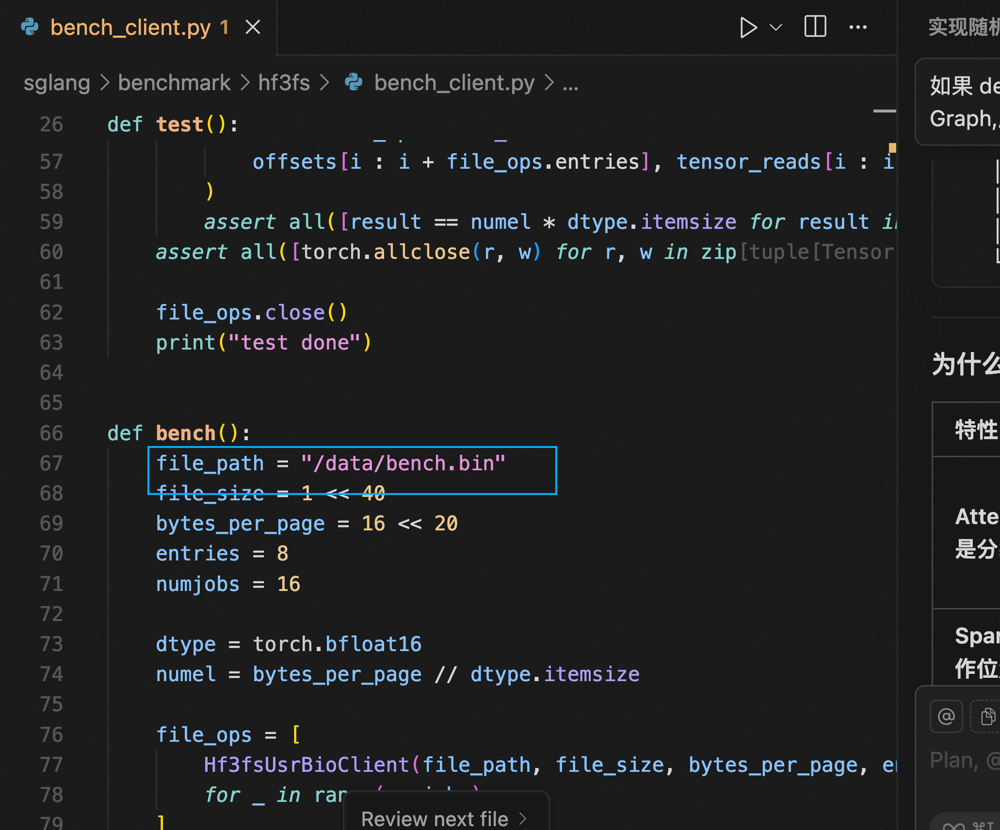

```shell
python3 sglang/benchmark/hf3fs/bench_client.py
```

预期结果
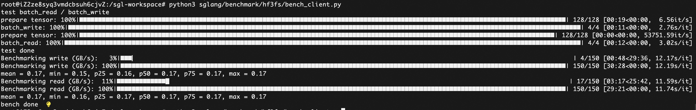

benchmark性能与盘读写性能有关，PL0+10000 iops对应180MB/s吞吐

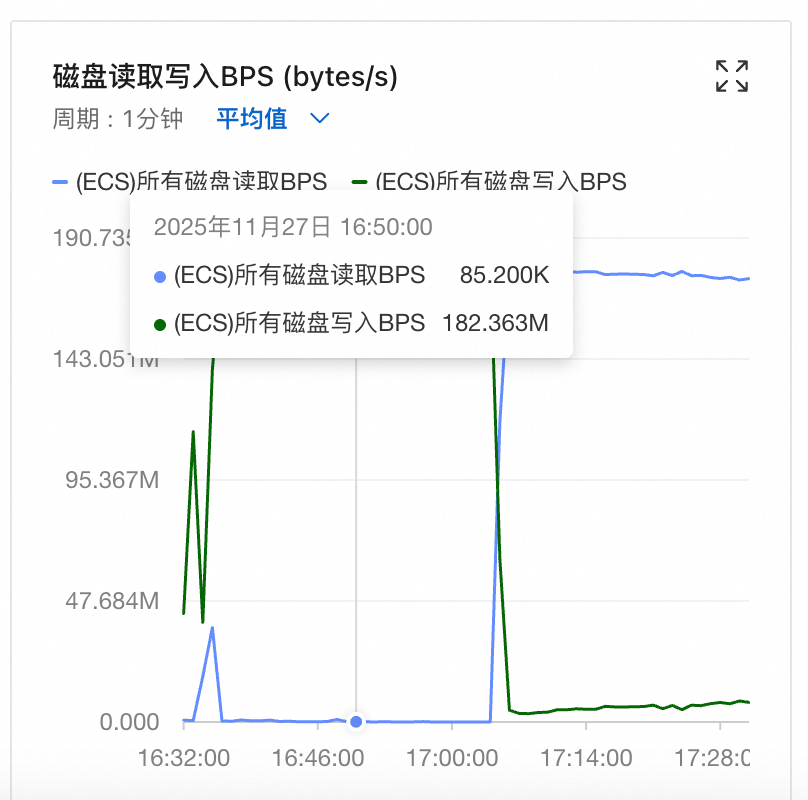
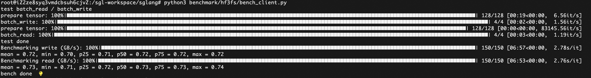

PL2+10w iops对应750MB/s吞吐

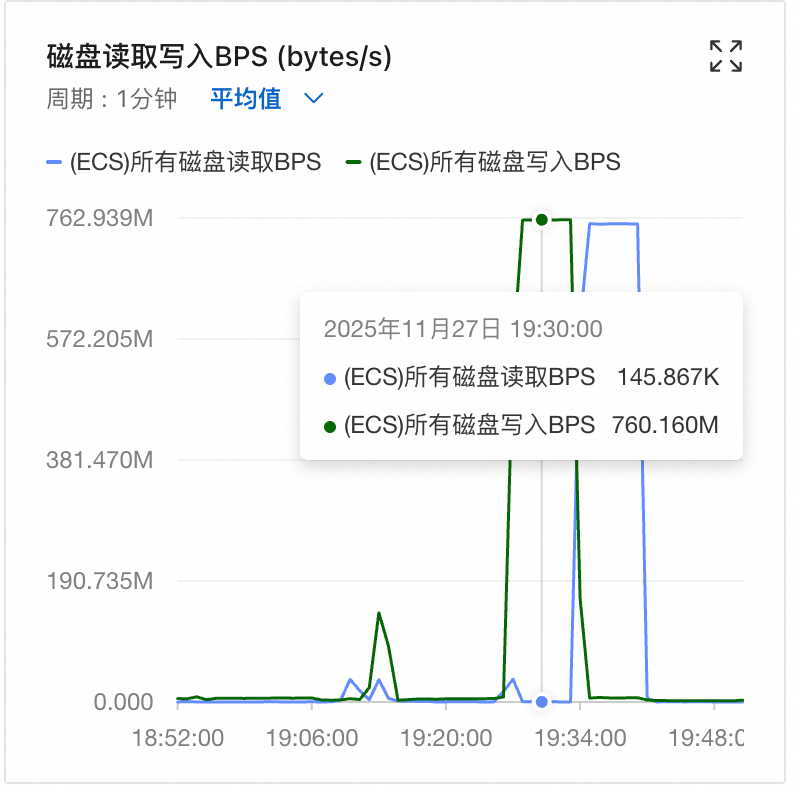
